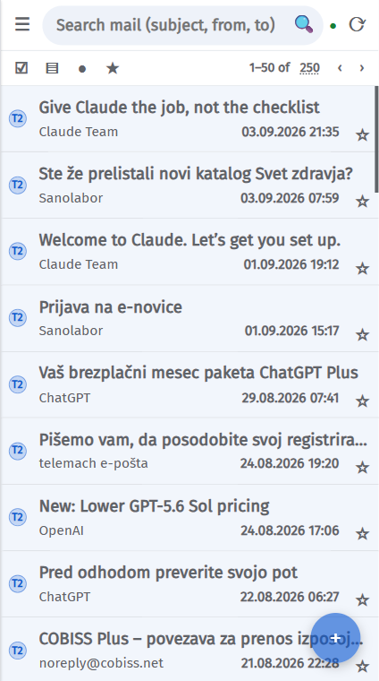
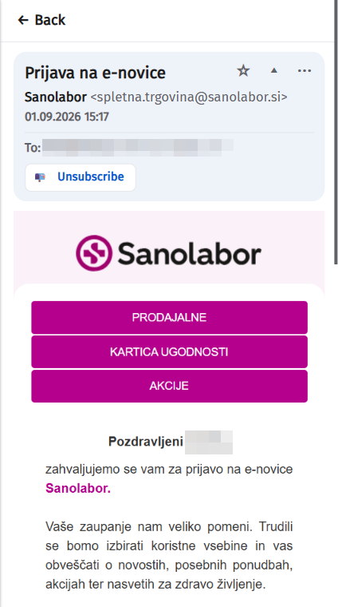
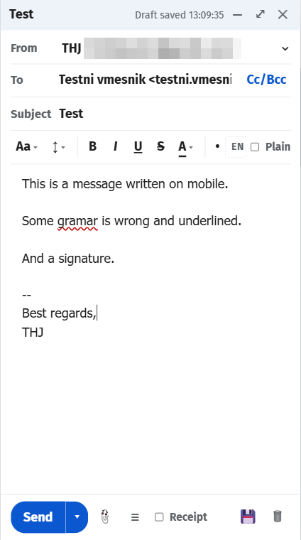
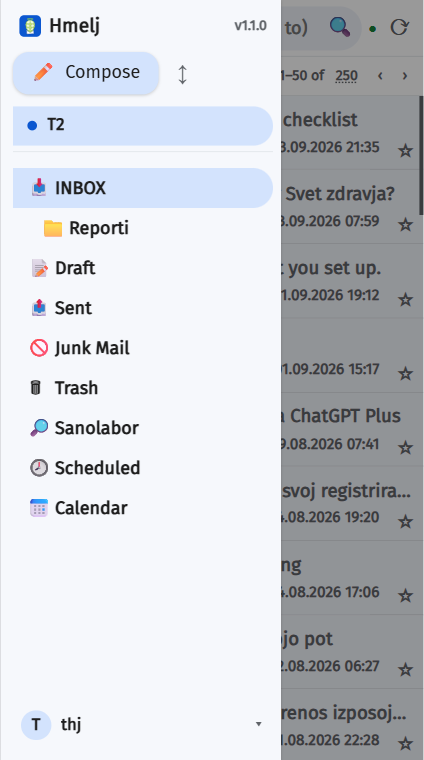

<div align="center">

# 🌿 Hmelj

**A self-hosted, Gmail-style webmail client for any IMAP/SMTP server — plus Microsoft 365, Outlook.com and Exchange.**

[](LICENSE)
[](https://github.com/thehijacker/hmelj/pkgs/container/hmelj)
[](https://thehijacker.github.io/hmelj/)

📖 **[Documentation](https://thehijacker.github.io/hmelj/)** · 🔒 [Privacy](https://thehijacker.github.io/hmelj/privacy.html) · 📦 [Releases](https://github.com/thehijacker/hmelj/releases)

</div>

---

Hmelj is a **universal, multi-account webmail client** you run yourself. Sign in with a Hmelj
account created on its own login page, then attach any number of mailboxes — a home IMAP
server, Gmail, GMX, a Microsoft 365 work account, an on-premises Exchange server — through an
in-app wizard. Read them one at a time, or all together in a unified **All inboxes** view
where every message carries a coloured chip of its source account.

One Node.js process, **no build step**, everything in one directory on your own server.
Mailbox passwords are encrypted at rest with AES-256-GCM. Nothing phones home.

> *Hmelj* is Slovenian for hops. The icon is a hop cone resting in an open envelope.

---

## Screenshots

| Inbox | All inboxes | Reading |
|:---:|:---:|:---:|
|  |  |  |
| **Conversation view** | **Composing** | **Search** |
|  |  |  |
| **Mailbox analytics** | **Settings** | **Dark theme** |
|  |  |  |

### Mobile

| List | Message | Compose | Menu |
|:---:|:---:|:---:|:---:|
|  |  |  |  |

---

## Quick start

```bash
mkdir hmelj && cd hmelj
curl -O https://raw.githubusercontent.com/thehijacker/hmelj/main/docker-compose.yml
curl -o .env https://raw.githubusercontent.com/thehijacker/hmelj/main/.env.example
docker compose up -d
```

Open **http://localhost:3000** and sign up. The first account is automatically an admin.

> **Bind-mounting a host directory?** No preparation needed — the container takes ownership
> of `/data` at startup and then drops to an unprivileged user before running any app code.
> Set `PUID`/`PGID` if you want the files owned by a specific account instead of `1000:1000`.

Read `.env` through before you settle on it — every setting has a working default, but a few
are worth a decision. Then put Hmelj behind a reverse proxy with TLS: mailbox passwords travel
over this connection, and installing it as a PWA requires HTTPS.

📖 **[Full installation guide →](https://thehijacker.github.io/hmelj/#install)**

---

## Features

### Accounts
- **IMAP + SMTP** — any server, with TLS and self-signed-certificate options
- **Gmail** — an app password, or *Sign in with Google* (OAuth2 / XOAUTH2)
- **Microsoft 365 & Outlook.com** — OAuth sign-in, then Microsoft Graph rather than IMAP (which is off by default on personal accounts and cannot be turned on from here)
- **Exchange (EWS)** — on-premises Exchange over NTLM
- **Multi-user** — separate Hmelj logins, each with their own mailboxes, settings and filters
- **Unified views** — merged Inbox and Sent, coloured per-account chips, per-account unread counts
- **Per-account monitoring** — IMAP IDLE for instant delivery, or a poll interval from 30 seconds to 15 minutes
- **Account presets**, editable by an admin, that prefill the wizard for your own provider
- **Share an account** with another Hmelj user
- Connection tested, and special folders auto-detected, before anything is saved

### Reading
- **Conversation view** — a message and its replies as one row, opened as a stack
- **Reading pane** right, bottom, in a new window, or list-only
- **Sandboxed rendering** — HTML sanitised server-side, drawn in an isolated iframe, scripts never run
- **External-image policy** — always, trusted domains only, ask per message, or never; CSS `url()` follows the same rule, so a tracker cannot hide in a background
- **Collapsed quotes** — the reply you were sent, with the thread beneath it behind a ⋯
- **One-click unsubscribe** — RFC 8058 POST, `mailto:`, or the sender's page, with a footer-link fallback
- **Attachment preview** for images, PDF, audio and video, with a real progress bar and streaming video
- **Find in message** (Ctrl/Cmd+F), live match count, without modifying the message
- **Calendar invitations** — accept, tentative or decline, with or without a reply
- **Read receipts** — asked for and answered on your terms, never automatically
- **Print · View headers · Save as EML · Open in a new view**

### Composing
- **Rich HTML or plain text**, multiple **identities** each with its own signature and policy
- **Scheduled sending** — queued on the server, retried with backoff, reschedulable
- **Draft autosave**, attachments, Cc/Bcc, priority, read-receipt request
- **Spell checking** as you type — Slovenian and English, detected automatically
- **Contact autocomplete**, learned from the mail you actually send

### Organising
- **Filters** — subject/from/to/content/size/date conditions; move, copy, redirect, auto-reply, delete, mark, star
- **Spam and Archive** in one gesture, with the return trip remembered per message
- **Select mode**, swipe gestures, right-click menus, undo on destructive actions
- **Search** with Gmail-style syntax — `from:`, `-word`, `"phrase"`, `is:starred` — cached-first with a one-click *Search everywhere*
- **Mailbox analytics** — where the quota went, who sends the most, what is safe to delete (and it counts Gmail labels honestly)
- **Contacts** — address book, Google-CSV and vCard import, direct pull from Microsoft or Exchange
- **Folders** — full tree, create/rename/delete/empty, hide per folder, unread counters

### Notifications
- **Web Push (VAPID)** for browsers and PWAs, working with Hmelj fully closed
- **Android push** via Firebase, with *Mark as read* / *Delete* on the notification and an unread badge
- **Quiet hours** per account and per folder, with weekday selection and a holiday calendar
- **Mute a folder** for an hour, until morning, or until a time you pick
- **Per-device** — see and remove every registered device

### Running it
- **One container**, `linux/amd64` and `linux/arm64`, non-root, with a healthcheck
- **Everything in one volume** — accounts, settings, filters, cache, encryption key
- **Admin panel** — users, sign-up control, OAuth clients, account presets, custom fonts
- **Per-user error log** in plain language, separate from server debug noise
- **Instant cross-device sync** over Server-Sent Events
- **PWA** install on desktop and mobile, plus a native Android APK
- **English and Slovenščina**

📖 **[Full documentation →](https://thehijacker.github.io/hmelj/)**

---

## Configuration

All configuration is environment variables; every one is optional.

| Variable | Default | Purpose |
|---|---|---|
| `PORT` | `3000` | Port to listen on |
| `HOST` | `0.0.0.0` | Bind address |
| `DATA_DIR` | `./data` (`/data` in Docker) | Where accounts, settings, filters and the cache live |
| `CACHE_DIR` | `DATA_DIR` | Where `cache.sqlite` lives. Point it at local disk if `DATA_DIR` is on a network mount — those writes are synchronous and can stall the process |
| `HMELJ_SECRET` | auto-generated | Key encrypting stored mailbox credentials. Unset, Hmelj writes `DATA_DIR/secret.key` instead. **Back it up.** |
| `ALLOW_SIGNUP` | `true` | Whether new users may register. The first user always can |
| `SYNC_INTERVAL_MS` | `120000` | Default background poll interval, minimum 30000. Overridable per account |
| `CACHE_ENABLED` | `true` | Kill switch for the poller and the SQLite cache. `false` runs fully live |
| `ATTACHMENT_CACHE_MB` | `32` | RAM held aside for already-extracted attachment bytes. `0` disables it |
| `LOG` | `info` | `error` \| `warn` \| `info` \| `debug` |
| `HMELJ_PUBLIC_URL` | derived | Public base URL. Only OAuth needs it — set it if a proxy rewrites the host |
| `VAPID_PUBLIC_KEY` / `VAPID_PRIVATE_KEY` / `VAPID_SUBJECT` | — | Web Push. Generate with `npm run vapid-keys`; notifications stay off until set |
| `PUSH_TTL_SECONDS` | `900` | How long a push service may hold a notification for an unreachable device |
| `FCM_SERVICE_ACCOUNT_PATH` | `DATA_DIR/fcm-service-account.json` | Firebase key for Android app push |
| `MS_OAUTH_CLIENT_ID` / `MS_OAUTH_TENANT` | — | Microsoft OAuth client, if you would rather not use Settings → Admin |
| `GOOGLE_OAUTH_CLIENT_ID` / `GOOGLE_OAUTH_CLIENT_SECRET` | — | Google OAuth client, likewise |

`.env.example` is the same list with the reasoning attached.
📖 **[Environment variables →](https://thehijacker.github.io/hmelj/#env)**

---

## Setting up sign-in with Google or Microsoft

Both need an OAuth client you register yourself — free, a few minutes, and it stays yours.
Hmelj deliberately has no shared client to fall back on. The two providers want opposite
things, and getting that wrong is the most common way for this to fail:

- **Microsoft** — a **public client** (*Mobile and desktop applications* platform), client ID only, **no secret**.
- **Google** — a **Web application** client, which is confidential and **does** need its secret. Set the consent screen to *In production*, or Google expires the sign-in every 7 days.

📖 **[Google walkthrough →](https://thehijacker.github.io/hmelj/#gmail-client)** ·
**[Microsoft walkthrough →](https://thehijacker.github.io/hmelj/#ms-register)**

---

## Android app

A native shell around the same web app, for the one thing a PWA on Android cannot do: receive
push while it is closed. Android's WebView implements no Web Push API at all, on any version,
so the app relays through Firebase Cloud Messaging instead. It also adds notification action
buttons, a launcher unread badge, OAuth sign-in in a real browser tab, and attachment hand-off
to other apps.

Download the APK from [Releases](https://github.com/thehijacker/hmelj/releases).
Google Play distribution is planned but not live yet.

📖 **[Android app →](https://thehijacker.github.io/hmelj/#android)** ·
**[Building it →](https://thehijacker.github.io/hmelj/#building)**

---

## Building from source

```bash
git clone https://github.com/thehijacker/hmelj.git
cd hmelj
npm ci
cp .env.example .env
npm start          # → http://localhost:3000
npm test           # 19 suites, no framework, no network
```

There is no build step — `public/` is served exactly as it is on disk, so an edit shows up on
the next refresh.

To try it without a real mail server, `npm run mock` starts a local IMAP (`:1143`) and SMTP
(`:1025`) pair with sample messages; in the wizard use `127.0.0.1`, user `testuser`, password
`testpass`, TLS off, "allow self-signed" on.

**Node version** — 24 or newer, which is what the Docker image and CI use. Node 20 reached
end of life in April 2026 and 18 before it; Node 24 is supported until April 2028. Running
from source on Node 22 still works today (22 is supported until April 2027) — npm will just
warn about the `engines` field.

**Architecture** — `server/` is an Express app: `index.js` (routes and the HTML sanitiser),
`session.js` (users, sessions, per-request context), `accounts.js` (mail accounts, encrypted
credentials), `imapClient.js` / `graphClient.js` / `ewsClient.js` (the three backends behind
one interface in `mailClient.js`), `smtpClient.js`, `cache.js` (SQLite), `sync.js` (the
poller), `idle.js` (live watchers), `filters.js`, `push.js`, `oauth.js`, and a handful of pure
modules with their own tests. `public/` is the vanilla-JS front end. `Android/` is the WebView
shell. `summary.md` and `HANDOFF.md` are the working engineering notes.

---

## Contributing

Issues and pull requests are welcome. Run `npm test` before opening one — the suites are plain
Node scripts with no framework, and they are fast.

## License

[AGPL-3.0](LICENSE) © 2026 Andrej Kralj

If you run a modified Hmelj as a network service, the AGPL requires you to make your changes
available to its users.
